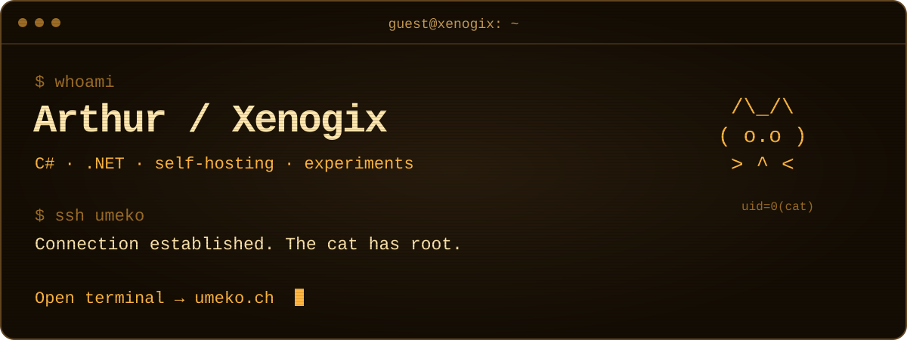

I build things with **C# and .NET**, tinker with self-hosting, and occasionally finish a project.

My corner of the internet is a retro terminal. Umeko has root. I just pay for the server.

**[🐾 Enter Umeko’s terminal => umeko.ch](https://umeko.ch)**
